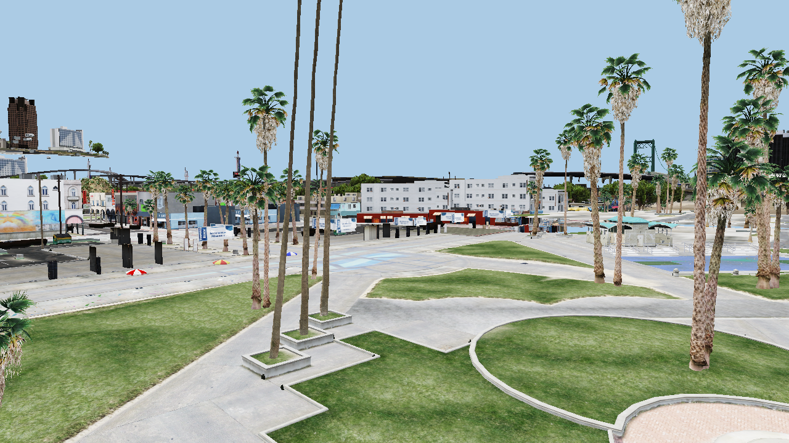
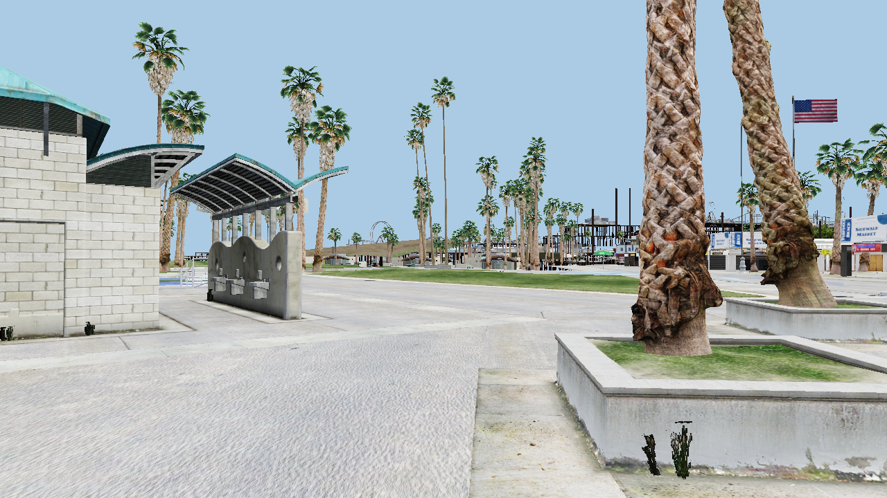
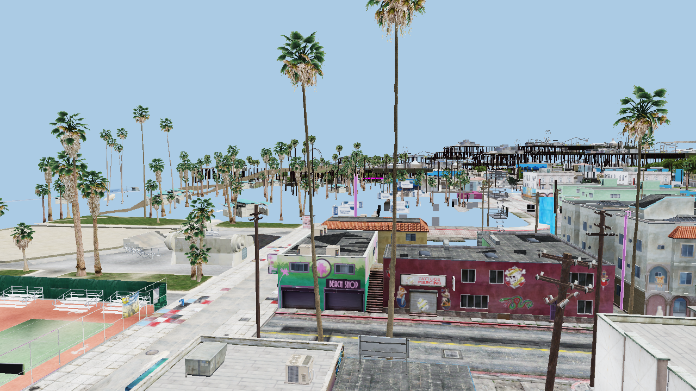
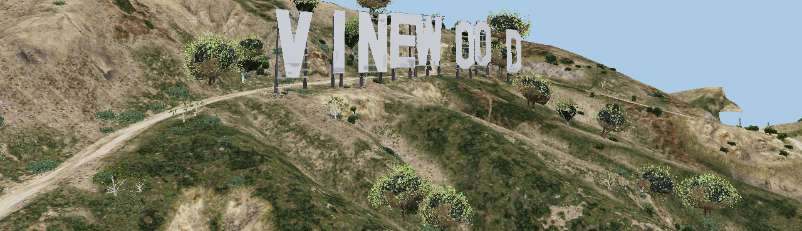

<h1 align="center">Vespucci</h1>

<p align="center">
A map viewer and (soon) editor for <b>Grand Theft Auto V</b> that draws the world with the game's <b>own shaders and data</b>.<br>
Native Direct3D 11 on Windows. Headless on Linux through DXVK, with no GPU required.
</p>

<p align="center">
<a href="https://github.com/VIRUXE/vespucci/actions/workflows/ci.yml"></a>


</p>



<p align="center"><sub>Vespucci Beach, 1280×720, rendered on a 2-core laptop CPU (lavapipe) in about five seconds. Every pixel comes from the game's own compiled shaders and materials.</sub></p>

## What this is

Tools like CodeWalker show you an *approximation* of the map. Vespucci is built on a different rule: **load the game's real shaders, bind them the way the game binds them, and render the game's real data**, so what you see in the editor is what you get in the game. It is the GTA V counterpart of [Ariane](https://github.com/Dryxio/ariane) for GTA III / Vice City / San Andreas.

Two ways to run the same code:

- **Desktop** (Windows): a Dear ImGui editor window on your gaming PC, native D3D11, any GPU. *(Milestone M6; the render core is what exists today.)*
- **Headless** (Linux, or Windows without a window): a command line that renders frames to PNG and answers questions about the map, and later an MCP server so an agent can drive the editor. Runs on a server with no display and no GPU, thanks to [DXVK](https://github.com/doitsujin/dxvk) on Mesa's lavapipe.

Everything is read from **your own copy of the game**; nothing of Rockstar's ships with Vespucci.

## Status

The render core is at milestone 4 of 6. What works today, all headless on Linux:

| | |
|---|---|
| ✅ Game access | Keys derived from your `GTA5.exe`, every `.rpf` (nested, 92 DLC packs in load order, 389k files), story-mode vs. Online map sets from the DLC change sets |
| ✅ Formats | Drawables (`.ydr`/`.ydd`/`.yft`), textures (`.ytd`, BC1–BC7), maps and archetypes (`.ymap`/`.ytyp`, 159k archetypes), the game's `.fxc` shader containers and DXBC reflection (696 shaders, 21k blobs, zero failures) |
| ✅ One model | `render-model` draws any prop with the game's shader, every cbuffer and texture bound from the model's own material parameters, binding report as JSON |
| ✅ Streamed world | `render` streams the map around a camera: LOD hierarchy, time-of-day objects, script-only maps filtered, decals and alpha in the right passes, HDR + tonemap. Vespucci Beach at 1280×720: 964 entities, 984 draws, 775 MB RSS, ~5 s |
| 🔜 M5 | Game-lit frame: sky, time cycle and weather, deferred lighting, post-processing, matched pass by pass against RenderDoc captures of the real game |
| 🔜 M6 | The editor: select, move/rotate/scale with gizmos, undo, object browser, save as a mod; the same operations over MCP in headless mode |

Limitations you will notice in today's renders: no sky, no shadows, a constant preview sun, no water, no interiors, no vehicles, and some reflective downtown buildings render dark. [docs/rendering.md](docs/rendering.md) lists them with the plan for each.

## Gallery

| | |
|---|---|
|  |  |
| Boardwalk, with the Del Perro pier and ferris wheel in the distance | The beach town from a rooftop: tennis courts, the pier, 1,328 streamed entities |



<p align="center"><sub>Vinewood hills: terrain, instanced vegetation and the sign, 1,560 entities within 400 m.</sub></p>

## Quick start

### Linux, headless

```sh
git clone https://github.com/VIRUXE/vespucci && cd vespucci
scripts/setup-linux.sh          # apt packages, Rust, DXVK-native (built once, ~20 min), lavapipe
cargo build --release

export GTAV_PATH="/path/to/Grand Theft Auto V"
./target/release/vespucci doctor --gpu               # keys, archives, Vulkan, a test triangle
./target/release/vespucci render --pos=-1280,-1450,4 --look=-1200,-1500,4 --out beach.png
```

The first run derives the archive keys from your executable (cached afterwards) and compiles the shader pipelines (also cached). A frame takes ~5 s warm on a slow CPU; a real GPU makes it near-instant.

### Windows

Cross-compile from Linux (the setup script installs mingw-w64):

```sh
cargo build --release --target x86_64-pc-windows-gnu
# target/x86_64-pc-windows-gnu/release/vespucci.exe
vespucci.exe doctor --gpu --game "C:\Program Files\Rockstar Games\Grand Theft Auto V"
```

The Windows binary uses the system D3D11 directly. See [docs/building.md](docs/building.md) for details and troubleshooting.

## Using it

```sh
vespucci ls x64c.rpf/levels/gta5/props                 # browse the archives as one file system
vespucci find --ext ydr --name prop_cs_heist_bag_01    # the file the game would load for a name
vespucci cat update/update.rpf/common/data/dlclist.xml # decrypt + extract anything
vespucci probe --pos=-1280,-1450,4 --radius 300        # what the game streams at a spot (no GPU)
vespucci shader normal_spec --reflect                   # cbuffers, textures, vertex inputs of a game shader
vespucci texture prop_veg_palmfan_1.ytd --out tex/     # textures to PNG
vespucci render-model prop_cs_heist_bag_01 --technique lightweightHighQuality0_draw --dump-binding bag.json
vespucci render --pos=600,1262,332 --look=711,1198,352 --fov 40 --time 18:30 --radius 500 --out vinewood.png
```

Full reference: [docs/cli.md](docs/cli.md).

## How it works

```
GTA5.exe ──keys──► .rpf archives (NG decryption, load order, nested mounts) ──► one flat file system
     .ytyp/.ymap/*_cache_y.dat ──► archetypes + map tree + LOD hierarchy ──► entities around the camera
     .ydr/.ydd/.yft + .ytd ──► geometry, materials, textures ──► D3D11 buffers and views
     .fxc ──► the game's compiled VS/PS + reflection ──► cbuffers and textures bound by name, as the game does
     three passes (opaque, decal, alpha) ──► linear HDR frame ──► tonemap ──► PNG / window
```

- The **shaders are the game's**: Vespucci never re-implements a material. Each `.fxc` container's DXBC blobs become D3D11 shaders; their reflection data says which constant buffers, offsets and texture slots exist; the drawable's material parameters fill them.
- The **engine-owned inputs** (matrices, sun, ambient, fog, shadow cascades) are the only thing Vespucci supplies. Today they are preview constants chosen to avoid the values that make the shaders go black or NaN; M5 replaces them with the game's own time-cycle values, validated against captures.
- **Direct3D 11 is the one graphics API**: on Windows the system one, on Linux DXVK-native (D3D11 on Vulkan, no Wine), so there is a single rendering code path and it works on a GPU-less server through lavapipe.
- **Verified, not assumed**: every binding rule, offset and quirk was established by disassembling the game's shaders and bisecting renders, and is written down in [docs/binding.md](docs/binding.md) and [docs/formats.md](docs/formats.md).

More in [docs/architecture.md](docs/architecture.md).

## Repository layout

```
crates/vespucci-d3d11    Direct3D 11 FFI (bindgen over DXVK's / mingw's d3d11.h) and a small safe wrapper
crates/vespucci-game     keys from the exe, RPF archives, DLC load order, flat file table
crates/vespucci-fxc      .fxc shader containers, DXBC reflection (RDEF, ISGN)
crates/vespucci-world    archetype DB, ymap tree, map sets, entities, LOD rule, streaming
crates/vespucci-render   shader cache, materials, textures, preview globals, model and world renderers
crates/vespucci          the command line
third_party/rage-formats vendored public-domain parser crate (RSC7, drawables, ytd, ymap/ytyp)
docs/                    architecture, formats, rendering, binding facts, debugging, CLI, status log
scripts/                 setup-linux.sh, golden.sh, vespucci-env.sh
tests/golden/            reference renders checked by scripts/golden.sh
```

## Roadmap

See [PLAN.md](PLAN.md) for the milestone table and exit tests, and [docs/STATUS.md](docs/STATUS.md) for the dated log of what was learned. Next up is **M5** (needs RenderDoc captures of the real game to match against), then **M6**, the editor and the MCP server. After that: vehicles and car generators, interiors, water, a web viewer for the headless server.

## Documentation

| | |
|---|---|
| [docs/building.md](docs/building.md) | Toolchain, DXVK-native, Windows cross-build, caches, troubleshooting |
| [docs/cli.md](docs/cli.md) | Every command and option |
| [docs/architecture.md](docs/architecture.md) | Crates, data flow, design decisions, conventions |
| [docs/formats.md](docs/formats.md) | Archives, resources, drawables, textures, maps, the LOD system, buckets |
| [docs/rendering.md](docs/rendering.md) | The frame pipeline, materials, preview globals, what is missing and why |
| [docs/binding.md](docs/binding.md) | Verified shader-binding facts and the traps (fog NaN, output scale, shadow dummies…) |
| [docs/debugging.md](docs/debugging.md) | Debug switches and the bisecting workflows that found every bug so far |
| [docs/STATUS.md](docs/STATUS.md) | Current state and development log |
| [docs/THIRD_PARTY.md](docs/THIRD_PARTY.md) | Provenance and licences of everything that is not original |

## Contributing

Bug reports with a camera position, verified format facts, and fixes with a golden test are the most useful things right now. Read [CONTRIBUTING.md](CONTRIBUTING.md) first: retail game files only, no game assets in the repository, facts go in `docs/`.

## Licence and legal

Vespucci is dual-licensed under [MIT](LICENSE-MIT) or [Apache 2.0](LICENSE-APACHE), at your option. Third-party components are listed in [docs/THIRD_PARTY.md](docs/THIRD_PARTY.md).

Vespucci is an independent fan project. It is not affiliated with, endorsed by, or associated with Rockstar Games or Take-Two Interactive. Grand Theft Auto and Rockstar Games are trademarks of Take-Two Interactive Software, Inc. Using Vespucci requires a legally purchased copy of Grand Theft Auto V; the program reads the game's files from your installation and distributes none of them. The screenshots in this repository are renders of game content made for illustration.
